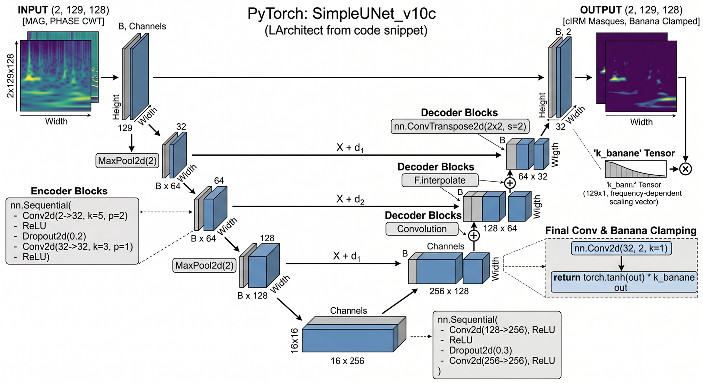
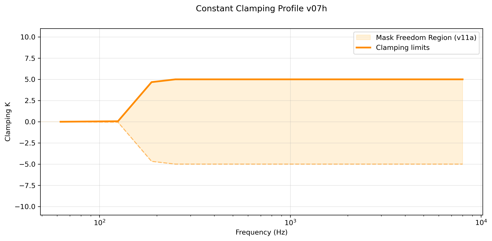
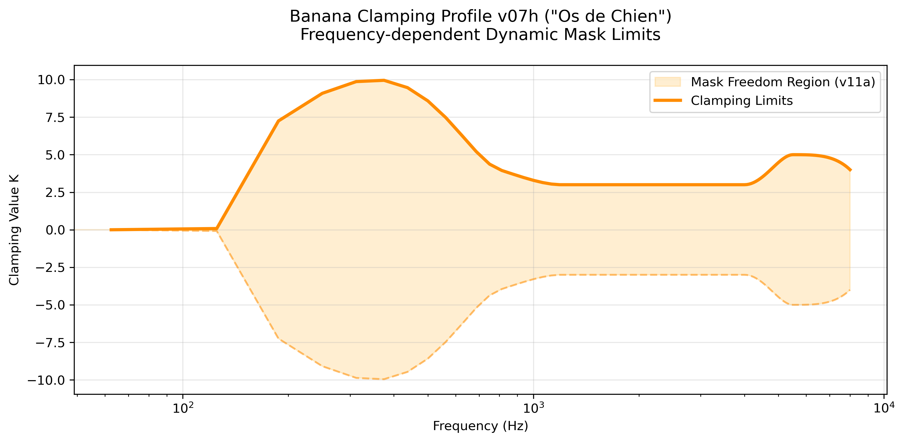
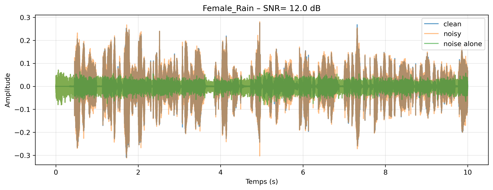
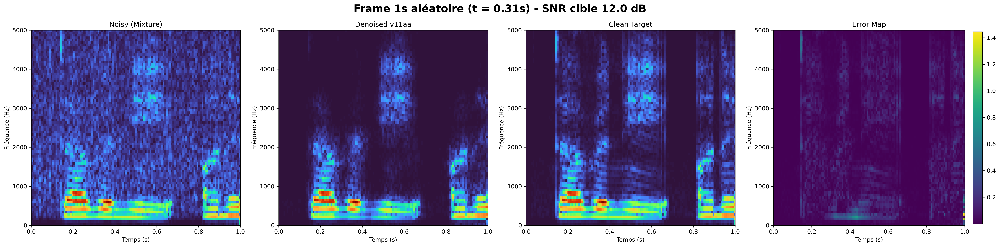
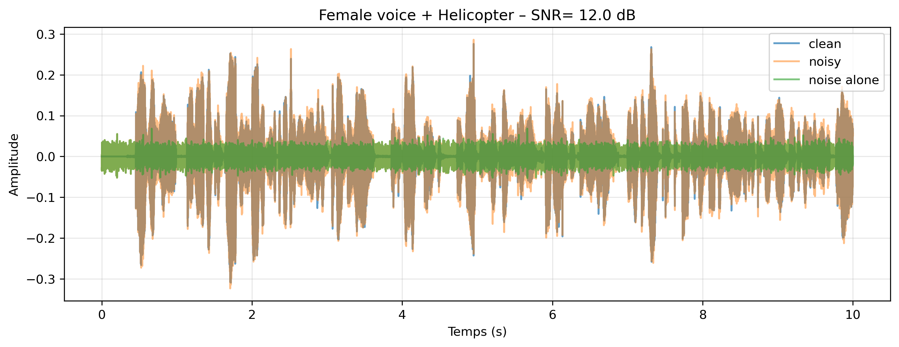
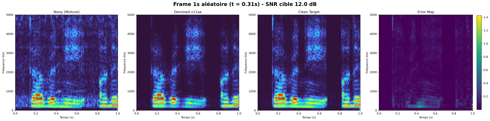

# Advanced Speech Denoising with Complex Masks STFT, CWT

<br> 

**Dr. Stéphane Dedieu** 
<br>Applied Mathematics | Digital Signal Processing | ML  <br>
January - March 2026  <br>
<a href="https://www.linkedin.com/in/sdedieu/">
  
</a>

<br>


## Project Overview

This repository explores **high-fidelity speech denoising** using **complex ratio masking** (cIRM) in the time-frequency domain.  

The current focus is on **STFT-based processing** with a lightweight **SimpleUNet** and a custom **frequency-dependent clamping strategy** ("Dog Bone" / Banana profile). This approach aims to deliver strong noise reduction while preserving natural speech quality, particularly on female voices.

Future work will extend the pipeline to **Continuous Wavelet Transform (CWT)** for better handling of non-stationary and impulsive noises.

### Project Goals
- Develop robust denoising solutions suitable for **edge / embedded** devices, targeting applications such as EERS communication systems.
- Maintain high voice clarity and reduce hoarseness even in low SNR conditions.
- Provide reproducible experiments with controlled SNR mixtures (0, 6, 12, 15 dB).

### Dataset
We use a custom pre-generated training dataset: **`dataset_mixtures_1s_2000_v110.npz`** (1.3 GB). <br> 
All audio clips (speech and noise) are pre-filtered with a **High-pass Bessel filter at 150 Hz (order 5)**.

- 2000 balanced 1-second frames (@ 16 kHz) with **STFT 128×128**
- Clean speech from LibriSpeech (balanced male + female voices)
- Noises from ESC-10: Rain, Sea Waves, Helicopter, Chainsaw, Fire Crackling
- Controlled SNR levels: -6, 0, 6, 12 dB

The model **v11a** was primarily trained on mixtures at **SNR = 6 dB**, which represents the main target operating condition, while being evaluated across a wider range (0, 6, 12, and 15 dB).

[📥 Download Dataset](https://drive.google.com/drive/folders/1k7sIiFVifEoUBanHORgapISwdpMvhn1P?usp=sharing)

## Model Architecture: SimpleUNet v11aa

The **SimpleUNet v11a** is a lightweight U-Net architecture designed for high-fidelity speech denoising in the complex STFT domain, optimized for embedded and edge audio applications.

### Key Architectural Features:
- **Input**: 2 channels (log-magnitude + phase) – shape `(Batch, 2, 129, 128)`
- **Encoder**: Three downsampling stages (32 → 64 → 128 features) using 5×5 and 3×3 convolutions
- **Bottleneck**: 256-feature layer for high-capacity representation
- **Decoder**: Symmetric upsampling with additive skip connections and bilinear interpolation to preserve fine acoustic details
- **Output**: Complex Ideal Ratio Mask (Real + Imaginary)
- **Banana Clamping** — frequency-dependent dynamic scaling applied at the final layer to constrain the mask according to acoustic priors.
  The Banana Clamping profile was specifically designed for **hostile and non-stationary environments** such as industrial machinery, and other strong broadband noises. In the notebook: helicopter, chainsaw from the ESC_10 dataset.  
      It provides a clear advantage in these difficult conditions by applying stronger suppression where needed while preserving naturalness in the vocal range. On more stationary noises (e.g. rain or sea waves), the benefit is smaller and a simpler constant clamping K=+/-5 can perform comparably.

<br>

**SimpleUNet architecture**

<br> 

<div align="center">
  
| <p align="center">  </p> |
| --- |
| <p align="center"> <i> **SimpleUNet Architecture** <br> (image generated by Gemini, with CWT as inputs/outputs) </i> </p> |

</div>

<br>

**Mask clamping**

<br> 

| <p align="center">  </p> | <p align="center">  </p> | 
| --- | --- |
| <p align="center"> <i> **Contant clamping K=+/-5** </i> </p> | <p align="center"> <i> **Banana clamping** </i> </p> |

<br>

### Loss Function
The model is trained with a hybrid multi-task loss combining:
- Mask L1 loss
- Waveform L1 loss (after ISTFT)
- Strong phase consistency loss

with adaptive scaling to balance the different terms.

This lightweight design (~2M parameters) achieves a good compromise between computational efficiency and denoising performance, particularly in challenging non-stationary environments.


### Edge Deployment & Optimization

The current **SimpleUNet v11a** model contains approximately **1.35 million parameters**. This size makes it suitable for mid-range edge platforms such as the Raspberry Pi, NVIDIA Jetson Nano, or modern mobile processors.

For tighter embedded constraints (low-power DSPs or microcontrollers), the architecture can be optimized without removing layers:
- Reducing the number of channels (e.g., 16-32-64-128 instead of 32-64-128-256)
- Switching to a smaller **STFT 64×64** representation
- Applying post-training quantization (INT8) and pruning

These modifications are expected to significantly reduce memory footprint and inference time while preserving most of the denoising performance. Future iterations will focus on making the model truly microcontroller-friendly.

## Results & Performance (v11a - Banana Clamping)

### Objective Results (PESQ - Wideband)

#### Performance Summary - Female Voice + Helicopter (10 seconds)

<div align="center">

| SNR    | PESQ Noisy | PESQ Denoised<br>(Model Phase) | Improvement<br>(vs Noisy) | Notes |
|--------|------------|--------------------------------|---------------------------|-------|
| 0 dB   | 1.029      | **1.195**                      | +0.166                    | Very challenging |
| 6 dB   | 1.071      | **1.515**                      |  +0.445                    | Reasonable recovery |
| 12 dB  | 1.263      | **2.046**                      | +0.783             | Good |
| 15 dB  | 1.441      | **2.363**                      | +0.922                    | Good |

</div>

<br>

#### Performance Summary - Female Voice + Rain (10 seconds)

<div align="center">

| SNR     | PESQ Noisy | PESQ Denoised<br>(Model Phase) |  Improvement<br>(vs Noisy) | Notes |
|---------|------------|--------------------------------|--------------------------|-------|
| 0 dB    | 1.041      | **1.543**                      |  +0.503                    | Decent intelligibility |
| 6 dB    | 1.090      | **1.596**                      |+0.506                    | Reasonable recovery  |
| 12 dB   | 1.263      | **1.980**                      |  +0.718                    | Good |
| 15 dB   | 1.445      | **2.268**                      |  +0.823                    | Good |

</div>


### Visual Results & Audio Demos

All visual results (waveforms, spectrograms, and error maps) as well as audio examples have been saved in the `/results` folder.

**Included demonstrations:**
- **Female voice + Rain** at SNR = 0, 6, 12, and 15 dB
- **Female voice + Helicopter** at SNR = 0, 6, 12, and 15 dB

You can listen to the full 10-second clips and explore the corresponding STFT visualizations directly in the [results](results/) directory.

**Female voice + Rain - SNR 12 dB**


<div align="center">
  
| <p align="center">  </p> |
| --- |
| <p align="center"> <b><i> 10 seconds waveform: Female voice + Rain at SNR = 12 dB </i></b> </p> |

</div>

<br>

<div align="center">
  
| <p align="center">  </p> |
| ---  | 
| <p align="center"> <b><i>  1 second frame: magnitude of STFT - female voice + Rain SNR= 12 dB </i></b> </p> |

</div>

<br>
<br>

**Female voice + Helicopter - SNR 12 dB**

<div align="center">
  
| <p align="center">  </p> |
| --- |
| <p align="center"> <b><i> 10 seconds waveform: Female voice + Helicopter at SNR = 12 dB </i></b> </p> |

</div>


<div align="center">
  
| <p align="center">  </p> |
| ---  | 
| <p align="center"> <b><i>  1 second frame: magnitude of STFT - female voice + Helicopter SNR= 12 dB </i></b> </p> |

</div>

### Audio Examples (10 seconds)


**Female voice + Rain - SNR 12 dB**
- [▶️ Listen to Noisy](results/Female_Rain_10s_SNR12dB_noisy.wav)  
- [▶️ Listen to Denoised v11aa](results/Female_Rain_10s_SNR12dB_denoised.wav)  
- [▶️ Listen Clean](results/Female_Rain_10s_SNR12dB_clean.wav)


**Female voice + Helicopter - SNR 12 dB**
- [▶️ Listen to Noisy](results/Female_Helico_10s_SNR12dB_noisy.wav)
- [▶️ Listen to Denoised v11aa](results/Female_Helico_10s_SNR12dB_denoised.wav)
- [▶️ Listen to Clean](results/Female_Helico_10s_SNR12dB_clean.wav)
---

**Key Takeaway**:  
The **Banana Clamping** ("Os de Chien") strategy delivers strong and consistent performance across different noise types and SNR levels, with particularly good voice clarity and harmonic preservation.


##  Future work

Extension to **Continuous Wavelet Transform (CWT)** for improved time-frequency resolution in highly impulsive industrial noise.


## ---------------- under construction
    
## Repository Structure (to be cleaned)

- `notebooks/` → Main experiments (v07r currently active)
- `precomputed_stft_v07r.pt` → Pre-computed STFTs for fast training
- `best_unet_denoiser_v07r.pth` → Best model checkpoint

## Next Steps

- Finalize post-processing and demo examples (10s clips)
- Create clean comparison tables and audio samples
- Prepare professional GitHub presentation
- Extend to CWT for non-stationary noise
- Industrial applications (EERS, bearing noise, MRI scanner, etc.)

---

**License**: MIT  
**Status**: Active research & development


## Setup & Requirements

```bash
pip install torch torchaudio numpy matplotlib scipy pesq pystoi torchinfo
